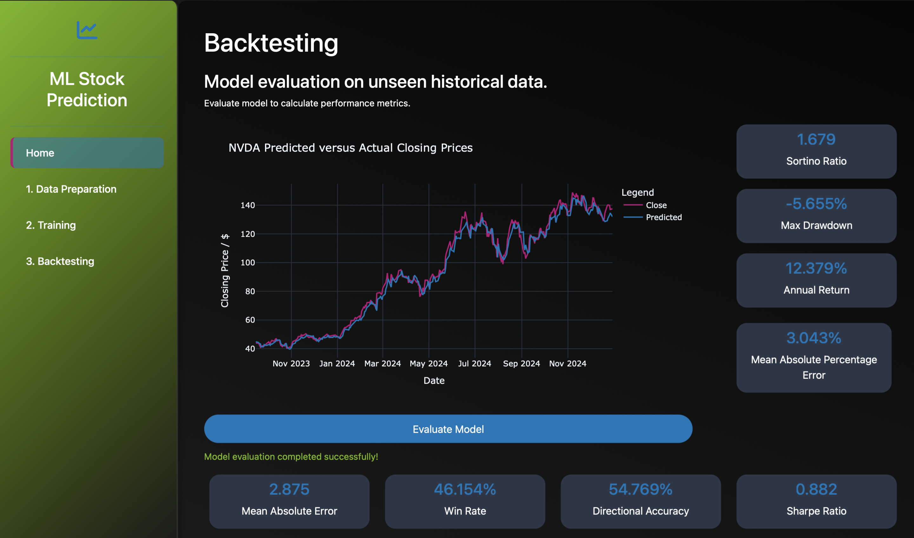

# nocturne_bloom
A Machine Learning Project for Financial Time-Series Analysis

<p align="center">
   
   
   
</p>

<p align="left">Tools and technologies utilised in this project:</p>

<p align="center">


<a href="https://github.com/pylint-dev/pylint"></a>
</p>

This repository supports a project exploring machine learning techniques for financial time-series analysis by building, evaluating, backtesting, and visualising next-day closing-price predictions for any stock. The repository combines data collection and preparation, feature engineering, an ensemble of predictive models (including CNN components), hyperparameter optimisation, backtesting, and a interactive Dash app for exploration.<p>

This project is licensed under the MIT License. It uses the Wharton Research Data Services (WRDS) library, which is restricted to non-commercial academic use. Users must have a valid WRDS account and comply with [WRDS Terms of Use](https://wrds-www.wharton.upenn.edu/users/tou/). No WRDS data is included in this repository.

## Table of contents
- [Academic Purpose](#academic-purpose)
- [Research Overview](#research-overview)
- [Quick start](#quick-start)
- [Utilisation](#utilisation-notes)
- [Installation](#installation-notes)
- [Project structure](#project-structure)
- Important workflow notes:
   - [Executing standard workflows](#executing-standard-workflows)
   - [Environment variables and secrets](#environment-variables-and-secrets)
   - [Long-running operations & resource notes](#long-running-operations--resource-notes)
- [Results](#results)
- [License](#license)

## Academic Purpose
This project was developed for research purposes, such as exploring machine learning techniques in financial time-series analysis. It is not intended for commercial use, investment advice, or real-world trading. All components, including data handling, are restricted to non-commercial academic contexts to comply with data provider terms.

## Research Overview
This project investigates the application of machine learning to financial time-series data, using NVIDIA (NVDA) stock as a case study.
The objectives include:
1. Analyzing historical OHLCV (Open, High, Low, Close, Volume) data and supporting tickers.
2. Developing and evaluating an ensemble of machine learning models, including convolutional neural network components, to study next-day closing price patterns.
3. Conducting hyperparameter optimization using frameworks such as Ray Tune and Optuna, with experiment tracking via Weights & Biases.
4. Evaluating model performance using regression and financial metrics, including backtesting simulations for research purposes.
5. Providing an interactive interface (built with Dash) to explore data, metrics, and visualizations, accessible via `app/app.py` and executed through `run.py`.

## Quick start

1) Clone the repository and change into the project directory:

```bash
git clone https://github.com/rayanjoshi/nocturne_bloom.git
cd nocturne_bloom
```

2) Install dependencies using uv:

```bash
pip install uv
# or on macOS: brew install uv
uv sync --all-extras
```

3) Provide required secrets in a `.env` at the repository root:

Use the provided `.env.example` as a template. You can either copy it and fill values, or populate secrets from the Dash UI (recommended):

```bash
cp .env.example .env

```

4) Run the Dash app:

```bash
uv run run.py

```

Then open the Dash UI in your browser at the printed local address (default: http://127.0.0.1:8050).

## Utilisation Notes

Configure the stock and data range in `configs/data_loader.yaml`. Keys used by the data loader:

- TICKER: stock ticker symbol (e.g., "NVDA")
- PERMNO / GVKEY: optional identifiers for CRSP / Compustat lookups (use when available)
- START_DATE / END_DATE: inclusive dates in YYYY-MM-DD format; START_DATE is often set to a quarter-prior to enable PE/PB calculations

Example:

```yaml
data_loader:
   TICKER: "NVDA"
   PERMNO: 86580
   GVKEY: 117768
   START_DATE: "2004-10-31" # quarter-prior date to allow PE/PB calculations
   END_DATE: "2022-12-31"
```

Notes:
- A valid WRDS account is required for queries that use PERMNO/GVKEY; the project will not function without appropriate WRDS credentials.
- After changing the config, re-run the Data Preparation workflow (or restart the Dash app and trigger data prep) to refresh processed data and predictions.
- If you switch tickers, consider clearing cache/data/processed to avoid mixing prior results with new runs.
- Dates must follow YYYY-MM-DD; missing PERMNO/GVKEY will attempt a ticker-based lookup if supported by your WRDS access.
- All use must comply with WRDS terms; no raw WRDS data is stored in this repository.

## Installation Notes

- The project uses **uv** as the package manager.
- This repository lists dependencies in `pyproject.toml` and a `uv.lock` file. Installing from `uv.lock` will give a stable, reproducible environment.
- The lockfile has pinned dependencies due to being generated on an Intel Mac.
- The project uses PyTorch/PyTorch Lightning, Ray Tune/Optuna, Dash + dash-bootstrap-components, and financial/data helper libraries such as `wrds`, `pandas-ta` and `backtrader`.

## Project Structure

```
nocturne_bloom
├─ LICENSE
├─ README.md
├─ app
│  ├─ __init__.py
│  ├─ app.py
│  ├─ assets
│  │  ├─ css
│  │  │  └─ custom.css
│  │  └─ model_architecture.png
│  ├─ cache
│  │  └─ cache.db
│  ├─ layout
│  │  ├─ __init__.py
│  │  └─ sidebar.py
│  └─ pages
│     ├─ __init__.py
│     ├─ backtesting.py
│     ├─ data_preparation.py
│     ├─ home.py
│     └─ training.py
├─ assets
│  └─ results.png
├─ configs
│  ├─ backtest.yaml
│  ├─ config.yaml
│  ├─ data_loader.yaml
│  ├─ data_module.yaml
│  ├─ feature_engineering.yaml
│  ├─ model_ensemble.yaml
│  └─ trainer.yaml
├─ data
│  ├─ predictions
│  ├─ preprocessing
│  ├─ processed
│  └─ raw
├─ models
│  └─ scalers
├─ pyproject.toml
├─ run.py
├─ scripts
│  ├─ __init__.py
│  ├─ feature_correlation.py
│  ├─ feature_importance.py
│  ├─ logging_config.py
│  ├─ run_backtest.py
│  ├─ train_model.py
│  └─ tune_model.py
├─ src
│  ├─ WRDS_query.sql
│  ├─ __init__.py
│  ├─ data_loader.py
│  ├─ data_module.py
│  ├─ feature_engineering.py
│  └─ model_ensemble.py
└─ uv.lock

```

## Executing standard workflows
The project's workflows can be accessed via the interactive interface.
1. Data Preparation: Use the Data Preparation page to input WRDS credentials and initiate data processing. This executes src/data_loader.py, src/feature_engineering.py, and src/data_module.py to prepare financial time-series data.
2. Hyperparameter Optimization: The Training page runs scripts/tune_model.py using Ray Tune or Optuna to explore model configurations.
3. Model Training: The Training page executes scripts/train_model.py to train the machine learning models.
4. Evaluation and Backtesting: The Backtesting page runs scripts/run_backtest.py to evaluate model performance and stores results in data/predictions/.

If you prefer CLI, these scripts live under `scripts/` and can be invoked with the repository Python environment. Example:

```bash
python scripts/train_model.py
python scripts/run_backtest.py
```

## Environment variables and secrets


A `.env` file at the repository root is required to store credentials securely. A safe-to-commit template is included as `.env.example`.

The interactive interface allows input of credentials (e.g., `WRDS_USERNAME`, `WRDS_PASSWORD`, `WANDB_API_KEY`) through the Data Preparation and Training pages. These inputs are written to the .env file for use by the application and scripts. Credentials are stored in plain text and should be handled securely to prevent unauthorized access.

### How the UI writes `.env`

When you submit credentials in the Dash UI the app's callbacks read the existing `.env` (if present), update or append the submitted keys (`WRDS_USERNAME`, `WRDS_PASSWORD`, `WANDB_API_KEY`), and rewrite the file at the repository root using simple key=value lines. Values are stored in plain text.

## Long-running operations & resource notes

- Hyperparameter tuning (Ray Tune / Optuna) and model training are CPU/GPU heavy. Run these on a machine with a GPU or increase timeouts accordingly.
- The UI executes training/tuning via `subprocess` calls to scripts in `scripts/`. Expect those operations to take minutes–hours depending on configuration.

## Results

Figure 1: NVDA Closing Prices and Predictive Model Results
<p>This graph was prepared using data accessed via Wharton Research Data Services (WRDS). WRDS and its third-party suppliers retain all rights to the underlying data, which is considered valuable intellectual property and trade secrets. The figure is provided solely for academic and educational purposes and may not be reproduced, distributed, or used for commercial purposes without explicit permission from WRDS. It includes only derived visualizations and does not contain raw WRDS data.

## License

This repository is released under the MIT License — see `LICENSE`.
<p>Disclaimer: All code in this repository is licensed under the MIT License.
Visualizations or results derived from WRDS data are included for academic and educational purposes only. No raw WRDS data is included. WRDS and its data providers retain all rights to the underlying data. Use of WRDS data is subject to their terms of service.